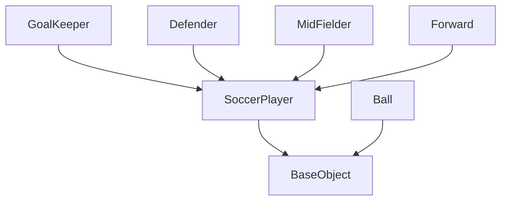
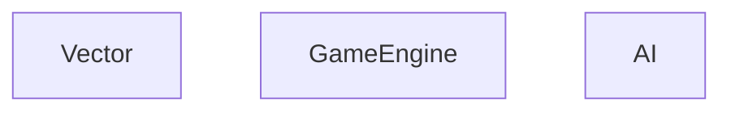
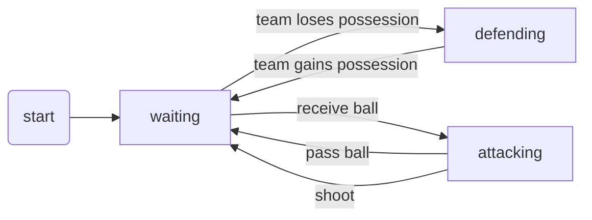
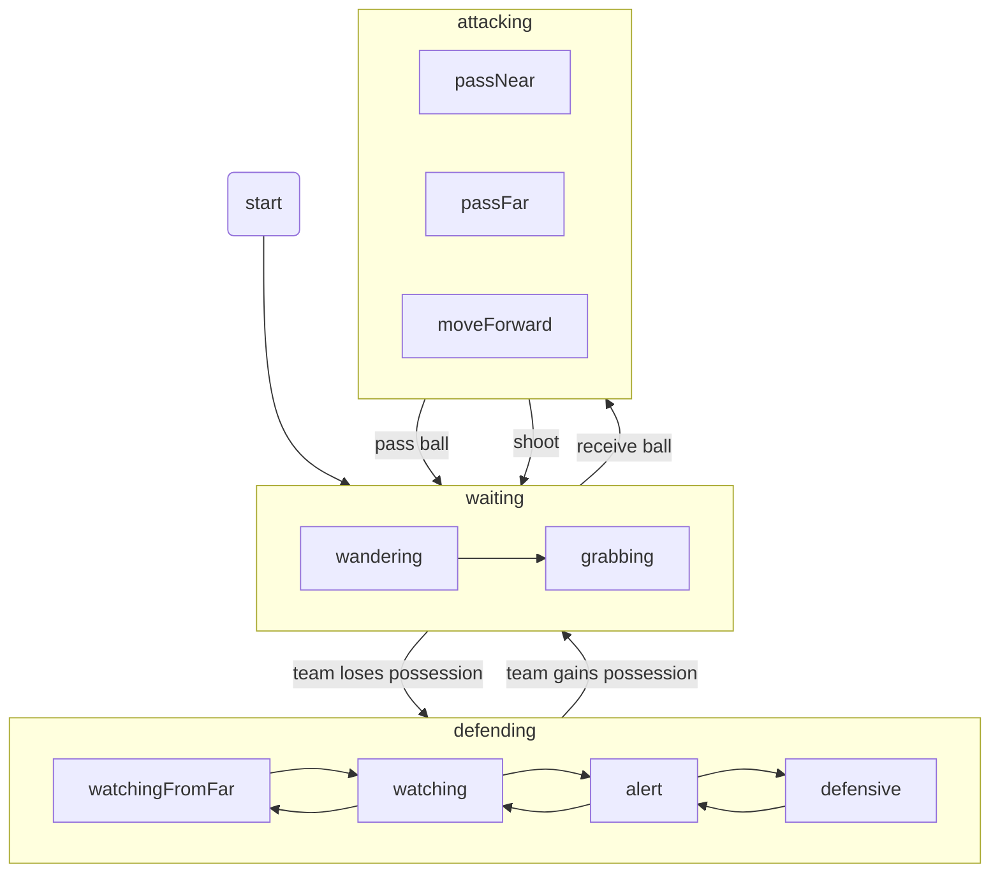
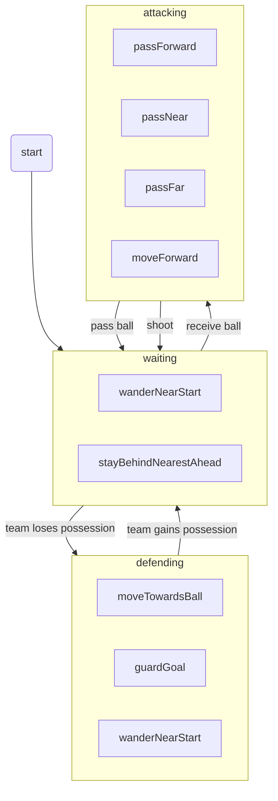
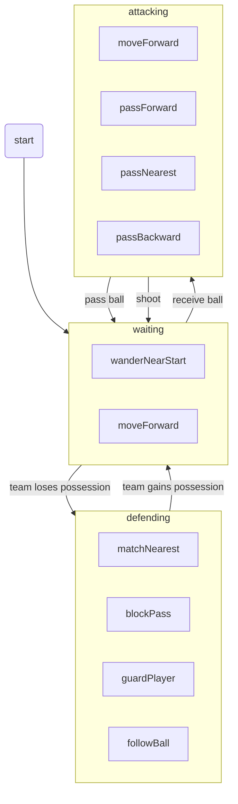
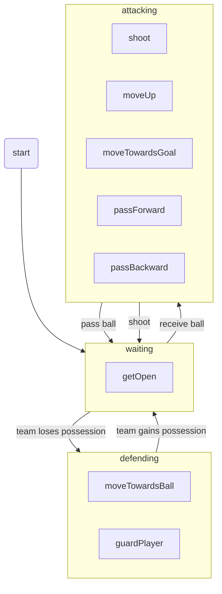

# SoccerJS





## SoccerPlayer

```typescript
enum States {
  waiting,
  defending,
  attacking,
}
```



## GoalKeeper



### Waiting State

- Wander around the goalkeeper box, this should be slow and random
- If the ball gets near, grab it

### Defending State

- Watch from the center of the goalkeeper box
- Match the balls y position within the goalkeeper box
- Cover the space between the ball the center of the goal
- Move towards the ball if close enough and grab or kick it

### Attacking State

- Pass ball to nearest teammate that is open
- Kick ball to the farthest teammate that seems open
- Dribble ball forward

## Defender



### Waiting State

- If ball is far, wander around start position
- If ball is near, stay behind nearest teammate

### Defending State

- If ball is near, move towards ball
- If ball near goal, move between ball and goalkeeper
- If ball far, wander around start position

### Attacking State

- If teammates far, move forward
- If teammates near ahead, pass forward
- If teammates near behind, pass near
- If too many opponents near, kick far forward towards far teammates

## MidFielder



### Waiting State

- When possible, stay near the starting position; wander at random
- When too far from the ball, move forward

### Defending State

- If far from ball, but ball on the same side as your starting point, follow it horizontally
- If near ball, follow ball
- If semi near ball and other opponents, stay between them
- If near opponent, stay close but between the player and the ball

### Attacking State

- If far from opponents, and far from teammates, move forward
- If teammates near in front of me, and they are open, and can pass to them, pass forward
- If teammates forward of me are blocked by opponents, and there are very near teammates, pass to nearest
- If teammates forward of me are blocked by opponents, and there are teammates behind me, pass backwards

## Forward



### Waiting State

- Must find a place near enough the player with the ball but away from opposing team

### Defending State

- If near the ball, move towards the ball
- If far from ball, stand between the ball and a nearby opponent

### Attacking State

- If not a lot of opponents are near, move ball forward
- If getting near goal, move towards goal
- If there is a teammate ahead of me, and they are open, pass ball forward
- If there is a teammate behind of me, and they are open, and there are too many opponents ahead and near, pass ball backward
